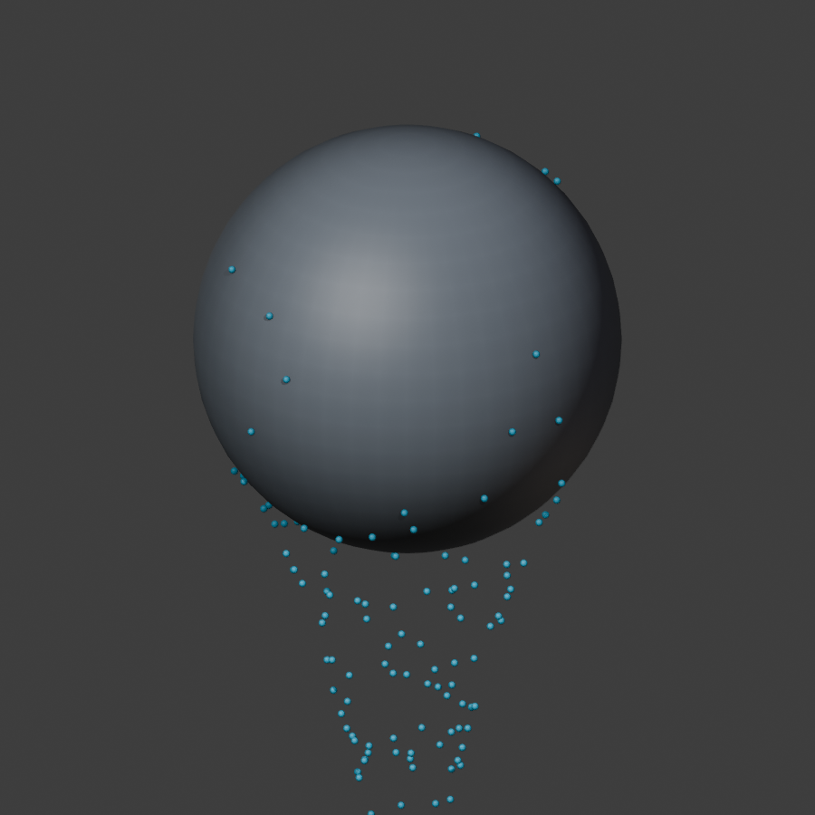

# Flumen

Experimental **Blender 5.2 LTS** surface flow and drips, version 0.0.3.

The development branch includes experimental connected water, coating, merging
and wetness. Its visual reference match and million-particle interactive target
are **not achieved**. The revised target is real-time particles while editing,
with final meshing deferred to a later bake. See the
[measured checkpoint](docs/CONNECTED_WATER_VALIDATION.md) and
[revised design for review](docs/superpowers/specs/2026-10-01-million-particle-preview-design.md).
The packaged 0.0.3 workflow and measurements below describe the earlier Drops
foundation; the development increment is not a new release.

## Field particle preview and offline bake (0.0.4, experimental)

Choose **Field Particle Preview** in **Sidebar > Flumen > GPU Flow** to simulate up
to one million surface-water particles live on a stationary mesh. The live preview
passes 1080p gates at 34-47 FPS on an RTX 5050. **Bake Particle Cache** writes the
particles to disk, and **Mesh Particle Cache** turns them into renderable water
that plays back without CUDA. See [Particle preview and bake](docs/PARTICLE_PREVIEW_AND_BAKE.md)
for the workflow, measured costs and the failed reference-drainage gate.

## GPU Flow: continuous emission

Install the Windows GPU extension built with the bundled Warp 1.17.0 wheel.
Select a stationary mesh, open **3D View > Sidebar > Flumen > GPU Flow**, and
choose **Create GPU Flow**. Use **Continuous** and **Particles Per Frame** to keep
emitting, or **Burst** to emit once. Emission Start/End are inclusive. Lifetime
and Capacity bound the live particle pool; expired slots are reused, and births
beyond capacity are dropped without building up a backlog.

Play from the scene start. After changing settings or collision geometry, click
**Reset GPU Flow**. Backward seeks replay from the start; repeated evaluation of
the same frame does not emit again. Source masks can reject samples, so the
panel reports accepted and rejected births separately. Frame-based rates change
particles per second when scene FPS changes.

On the local RTX 5050, the 600-frame **1920x1080 solid viewport** acceptance run
averaged **56.6 FPS**, with **25.02 ms p95** total frame time and 7,743 live drops
at the end. This fixture uses an 8,192-particle capacity, 64 births/frame, a
4-second lifetime, and approximately 20,000 collision triangles. See
[raw viewport evidence](artifacts/benchmark-gpu-viewport.json). Other meshes and
viewport modes can perform differently; JIT initialization is excluded.

GPU Flow is **live particle preview** on stationary surfaces. It does not yet
produce the reference video's connected films/rivulets or transport water on
deforming surfaces. GPU hosts are excluded from offline rendering until a bake
export workflow is implemented. Existing Geometry Nodes bakes remain available
through the older Animated Flow workflow described below.

Open [Flumen_GPU_Demo.blend](artifacts/Flumen_GPU_Demo.blend) with the GPU extension
enabled, then play frames 1-720. The file stores settings; CUDA state is
reconstructed on playback. See [GPU setup and packaging](docs/GPU_SETUP.md).

Two legacy workflows remain available: static drainage paths, and animated Geometry Nodes particles with surface resistance, adhesion, detachment, collision, and native baking. The animated workflow is a procedural approximation inspired by *A Practical Guide to Thin Film and Drips Simulation* (SIGGRAPH 2019). It does not implement the paper's FLIP/APIC solver or liquid films.

## Try the baked demo

Open [Flumen_M1_Demo.blend](artifacts/Flumen_M1_Demo.blend). Play or scrub frames **1-72**. Choose Sphere, Slope, Bottle rim, Opposing sheets, Concave fold, or Suzanne from Blender's scene selector. Bakes are packed into the file; the generated nodes work without installing the add-on. The cyan drops are an opaque diagnostic display, not a water shader.



## Install and create your own

1. In Blender 5.2, use Preferences > Get Extensions > Install from Disk, selecting [flumen-0.0.4.zip](artifacts/flumen-0.0.4.zip).
2. Select a stationary mesh. Set Scene Unit Scale to **1.0** (one Blender unit = one meter). The mesh needs height variation along Gravity; tilt a horizontal plane before setup.
3. Open 3D View > Sidebar > Flumen. Choose **Create Animated Flow**, or **Build Flumen** for static paths.
4. For animation, keep the new water host unparented with identity transforms. Tune inputs in its Geometry Nodes modifier and play sequentially from the start frame.
5. Save the file, then use the host's native **Simulation Nodes bake** controls. Choose Packed for a portable file. Bake before jumping between frames or rendering out of order.

After changing collision geometry, source, gravity, resistance, time range/FPS, or other simulation controls: delete **this host's** bake/cache, return to the start frame, and replay/rebake. Material changes are downstream of stored state and do not require recomputing particle motion. Each host has independent state.

Development installation remains available through `scripts/install_dev.py` in Blender's Text Editor.

## Scope and limits

- Static paths retain the original workflow. Rebuild preserves socket IDs, modifier values, drivers, and external links, and rolls back on candidate failure.
- Animated M1 seeds once, caps the budget at 2,048 particles, and uses 8-64 adaptive substeps by default. Seed density is conservatively capped using total surface area; a narrow source can seed fewer particles than its budget. Particle age is seconds; static trail age is an iteration index.
- Collision meshes must remain stationary throughout the simulation. Animated transforms, deformation, and changing topology are unsupported. Do not move the water host.
- Attached drops use tangent gravity with linear drag. Free drops use ballistic integration with a radius-extended ray and proximity clearance. This is approximate collision, particularly around sharp edges and grazing contacts.
- Travel clamps prevent large jumps when the substep cap is insufficient; `sf_step_limited` reports the resulting loss of accuracy. `Diagnostics` exposes volume totals, particle counts, blocked/limited counts, and actual substeps.
- No merging, continuous emission, persistent animated trails, wetness, films, or moving-surface transport in M1. These remain gated future work.
- Performance depends heavily on geometry and adaptive substeps. See measured results in [Implementation status](docs/IMPLEMENTATION_STATUS.md); the 100 ms preview target is not a guarantee.

## Build and verify

```text
python -m pytest -q
blender --background --factory-startup --python-exit-code 1 --python scripts/run_blender_tests.py
python scripts/build_extension.py artifacts/extension-stage
blender --background --factory-startup --command extension validate artifacts/extension-stage
blender --background --factory-startup --python-exit-code 1 --python scripts/smoke_test_blender.py -- --package artifacts/extension-stage
blender --background --factory-startup --command extension build --source-dir artifacts/extension-stage --output-dir artifacts
```

Use a new staging directory each time. `flumen/` is canonical; `flumen/` is its distribution mirror. See [Testing](docs/TESTING.md), [Algorithm](docs/ALGORITHM.md), and the [implementation plan](docs/superpowers/plans/2026-09-24-geometry-nodes-drips.md).
